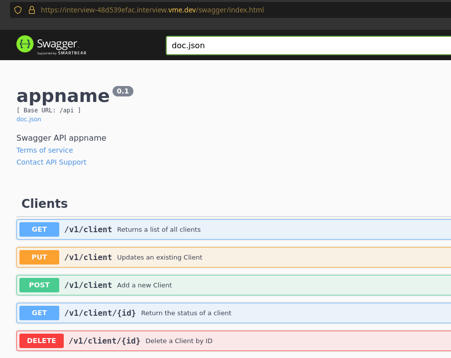

# Description

0. Ensure that you can connect to the kubernetes control plane API using the provided kubeconfig file
**** Your kubeconfig has access to ONLY the namespace interview-48d539efac ****
**** ENSURE ALL YOUR WORK TARGETS THE ABOVE NAMESPACE ****


1. Deploy the sample app (docker image: gbolo/sample-app:1.2) your namespace. See below for details
  - sample app requires talking to a mysql database
  - sample app can be configured with environment variables:
      # define what port to listen on
      APP_SERVER_BIND_PORT=60061
      # define connection string for database
      # format: <username>:<password>@tcp(<host>:<port>)/<database>
      APP_DATABASE_DSN="sample:password@tcp(127.0.0.1:3306)/sample"


2. Expose the sample app with an ingress that has the hostname: interview-48d539efac.interview.vme.dev
	- The above FQDN will get registered once the object is created. Please allow a few minutes for DNS propagation
	- access the ingress with TLS: https://interview-48d539efac.interview.vme.dev
		** certmanager is installed and will take care of getting a TLS certficate **

3. Create a script that will interact with the sample app
	- sample app is a REST API. see https://interview-48d539efac.interview.vme.dev/swagger for details
	- There is a list of clients in csv format, Ensure all clients are onboarded

4. Submit all deployment code (for all steps above) for review.
	- You may zip it and email it
	- You may provide it in a git repo

# Tasks


## Validation

* Validation docker image source :

```
$ docker pull gbolo/sample-app:1.2
1.2: Pulling from gbolo/sample-app
0a6724ff3fcd: Pull complete


$ docker history --no-trunc gbolo/sample-app:1.2  | tr -s " " | cut -d " " -f 8-

CMD ["/sample-app"] 0B
COPY dir:11b74ed4747114cbd38214ea295bffe06acb8b365604037e211663686ec39440 in / 938B
COPY multi:8696b9ca4f7009625c3fa310ea6203657acd75c79521f30f4ed158c554a93f5d in / 46.6MB
ENTRYPOINT ["/usr/bin/dumb-init" "--" "/entrypoints/entrypoint-base"] 0B
baseos_build_ref=undefined /bin/sh -c set -xe; apk upgrade --no-progress --no-cache && echo 'hosts: files dns' > /etc/nsswitch.conf && apk add --no-cache ca-certificates openssl dumb-init tini tzdata && update-ca-certificates && ln -fs /usr/share/zoneinfo/${TZ} /etc/localtime && echo ${TZ} > /etc/timezone && wget --no-verbose -O /usr/local/bin/gosu "https://github.com/tianon/gosu/releases/download/${GOSU_VERSION}/gosu-amd64" && wget --no-verbose -O /usr/local/bin/confd "https://github.com/kelseyhightower/confd/releases/download/v${CONFD_VERSION}/confd-${CONFD_VERSION}-linux-amd64" && chmod 555 /usr/local/bin/* && chmod 555 /entrypoints/* && apk del openssl 10MB
COPY file:2eb2a2135d3cc933d4bb64edd15103289a7d310238ab1139ee9cec2c04aaec6c in /entrypoints/entrypoint-base 1.89kB
ENV BASEOS=alpine- BASEOS_BUILD_DATE=undefined BASEOS_BUILD_REF=undefined GOSU_VERSION=1.11 CONFD_VERSION=0.16.0 0B
LABEL maintainer=George Bolo <gbolo@linuxctl.com> vendor=linuxctl.com com.linuxctl.baseos=alpine- com.linuxctl.baseos.build-date=undefined com.linuxctl.baseos.build-ref=undefined 0B
ARG baseos_build_ref=undefined 0B
ARG baseos_build_date=undefined 0B
ARG baseos=alpine- 0B
CMD ["/bin/sh"] 0B
ADD file:8ed80010e443da19d72546bcee9a35e0a8d244c72052b1994610bf5939d479c2 in / 5.61MB
```

validation kubernetes

```
$ kubectl  get namespace
Error from server (Forbidden): namespaces is forbidden: User "system:serviceaccount:interview-48d539efac:candidate" cannot list resource "namespaces" in API group "" at the cluster scope

$ kubectl -n interview-48d539efac get all
No resources found in interview-48d539efac namespace.

$ kubectl auth  can-i  -n interview-48d539efac create pods
yes
```

## Task 1 - spin up the app

### Deploy mysql service

I tried to setup the percistent volume sadly I do not have right for that.

```
$ kubectl -n interview-48d539efac apply -f sql-pvc.yaml
persistentvolumeclaim/mysql-pv-claim created
Error from server (Forbidden): error when retrieving current configuration of:
Resource: "/v1, Resource=persistentvolumes", GroupVersionKind: "/v1, Kind=PersistentVolume"
Name: "mysql-pv-volume", Namespace: ""
from server for: "sql-pvc.yaml": persistentvolumes "mysql-pv-volume" is forbidden: User "system:serviceaccount:interview-48d539efac:candidate" cannot get resource "persistentvolumes" in API group "" at the cluster scope

```

So the mysql service without the pvc :

```
$ kubectl -n interview-48d539efac apply -f mysql-service.yaml

$  kubectl -n interview-48d539efac get all
NAME                         READY   STATUS    RESTARTS   AGE
pod/mysql-55cf698894-6zkpz   1/1     Running   0          46s

NAME            TYPE        CLUSTER-IP   EXTERNAL-IP   PORT(S)    AGE
service/mysql   ClusterIP   None         <none>        3306/TCP   47s

NAME                    READY   UP-TO-DATE   AVAILABLE   AGE
deployment.apps/mysql   1/1     1            1           46s

NAME                               DESIRED   CURRENT   READY   AGE
replicaset.apps/mysql-55cf698894   1         1         1       46s
```

### First app deploy 

```
$ kubectl -n interview-48d539efac logs --previous simple-app-6dc9fd97fc-grh22
> Executed entrypoint-base on: Sat Jan 29 15:33:46 UTC 2022
> Version Information:
BASEOS_BUILD_DATE=undefined
BASEOS_BUILD_REF=undefined
> Executing as uid [0]: /sample-app
N 2022-01-29 15:33:46 (backend config.go:61) [initViper] initialized: version 1.0 (ref unknown) go1.13.1 [linux/amd64]
I 2022-01-29 15:33:46 (backend config.go:67) [initViper] using config file: /config.yaml
D 2022-01-29 15:33:46 (backend config.go:73) [printConfigSummary] Configuration:
D 2022-01-29 15:33:46 (backend config.go:82) [printConfigSummary] log_level: DEBUG
D 2022-01-29 15:33:46 (backend config.go:82) [printConfigSummary] server.bind_address: 0.0.0.0
D 2022-01-29 15:33:46 (backend config.go:82) [printConfigSummary] server.bind_port: 60021
D 2022-01-29 15:33:46 (backend config.go:82) [printConfigSummary] server.tls.enabled: false
D 2022-01-29 15:33:46 (backend config.go:82) [printConfigSummary] server.access_log: false
D 2022-01-29 15:33:46 (backend config.go:82) [printConfigSummary] server.compression: false
I 2022-01-29 15:33:46 (backend database.go:30) [openDatabase] opening database connection using driver: mysql
D 2022-01-29 15:33:46 (backend database.go:31) [openDatabase] dsn: sample-user:bad_password@tcp(mysql:3306)/sampledb
C 2022-01-29 15:33:46 (backend backend.go:18) [StartBackendDeamon] unable to connect to database: Error 1045: Access denied for user 'sample-user'@'10.204.9.237' (using password: YES)
```

The user name is sample-app : 

```
root@mysql-55cf698894-6zkpz:/# mysql -u sample-app -p  -h mysql --database sampledb
Enter password:
Welcome to the MySQL monitor.  Commands end with ; or \g.
Your MySQL connection id is 14
Server version: 5.6.51 MySQL Community Server (GPL)

Copyright (c) 2000, 2021, Oracle and/or its affiliates. All rights reserved.

Oracle is a registered trademark of Oracle Corporation and/or its
affiliates. Other names may be trademarks of their respective
owners.

Type 'help;' or '\h' for help. Type '\c' to clear the current input statement.

mysql> show databases;
+--------------------+
| Database           |
+--------------------+
| information_schema |
| sampledb           |
+--------------------+
2 rows in set (0.00 sec)

mysql> ^DBye
```

It was a code 18 :D. I fix my configuration definition :

```
$ kubectl -n interview-48d539efac logs simple-app-5545996f99-j4clx
> Executed entrypoint-base on: Sat Jan 29 15:46:21 UTC 2022
> Version Information:
BASEOS_BUILD_DATE=undefined
BASEOS_BUILD_REF=undefined
> Executing as uid [0]: /sample-app
N 2022-01-29 15:46:21 (backend config.go:61) [initViper] initialized: version 1.0 (ref unknown) go1.13.1 [linux/amd64]
I 2022-01-29 15:46:21 (backend config.go:67) [initViper] using config file: /config.yaml
D 2022-01-29 15:46:21 (backend config.go:73) [printConfigSummary] Configuration:
D 2022-01-29 15:46:21 (backend config.go:82) [printConfigSummary] log_level: DEBUG
D 2022-01-29 15:46:21 (backend config.go:82) [printConfigSummary] server.bind_address: 0.0.0.0
D 2022-01-29 15:46:21 (backend config.go:82) [printConfigSummary] server.bind_port: 60021
D 2022-01-29 15:46:21 (backend config.go:82) [printConfigSummary] server.tls.enabled: false
D 2022-01-29 15:46:21 (backend config.go:82) [printConfigSummary] server.access_log: false
D 2022-01-29 15:46:21 (backend config.go:82) [printConfigSummary] server.compression: false
I 2022-01-29 15:46:21 (backend database.go:30) [openDatabase] opening database connection using driver: mysql
D 2022-01-29 15:46:21 (backend database.go:31) [openDatabase] dsn: sample-app:bad_password@tcp(mysql:3306)/sampledb
D 2022-01-29 15:46:21 (backend server.go:122) [configureTLS] TLS not enabled, skipping TLS config
I 2022-01-29 15:46:21 (backend server.go:77) [startHTTPServer] starting HTTP server: listening on 0.0.0.0:60021
```


## Task 2 - expose the app

### Create services for the app

Create the app service : 

```
$ cat app-service.yaml
apiVersion: v1
kind: Service
metadata:
  name: sample-app
spec:
  selector:
    app: simple-app
  ports:
    - protocol: TCP
      port: 60021
      targetPort: 60021

$ kubectl -n interview-48d539efac get service
NAME         TYPE        CLUSTER-IP     EXTERNAL-IP   PORT(S)     AGE
mysql        ClusterIP   None           <none>        3306/TCP    65m
sample-app   ClusterIP   172.20.249.1   <none>        60021/TCP   12m

```

Create the ingress : 

```
$ cat ingress.yaml
apiVersion: networking.k8s.io/v1
kind: Ingress
metadata:
  name: ingress
  annotations:
    kubernetes.io/ingress.class: "nginx"
spec:
  rules:
    - host: interview-48d539efac.interview.vme.dev
      http:
        paths:
          - path: /
            pathType: Prefix
            backend:
              service:
                name: sample-app
                port:
                  number: 60021

$ kubectl -n interview-48d539efac get ingress
NAME      CLASS    HOSTS                                    ADDRESS                                                                     PORTS   AGE
ingress   <none>   interview-48d539efac.interview.vme.dev   a0341cb57067e40468a59c6053efecdc-786766422.ca-central-1.elb.amazonaws.com   80      29s

$ dig interview-48d539efac.interview.vme.dev +short
3.99.118.99
3.97.101.211
```

The service is exposed and as expected cert-manager did the work for the certificat



```
$ openssl  s_client -connect interview-48d539efac.interview.vme.dev:443
CONNECTED(00000003)
depth=2 C = US, O = Internet Security Research Group, CN = ISRG Root X1
verify return:1
depth=1 C = US, O = Let's Encrypt, CN = R3
verify return:1
depth=0 CN = *.interview.vme.dev
verify return:1
 ---
Certificate chain
 0 s:CN = *.interview.vme.dev
   i:C = US, O = Let's Encrypt, CN = R3
 1 s:C = US, O = Let's Encrypt, CN = R3
   i:C = US, O = Internet Security Research Group, CN = ISRG Root X1
 2 s:C = US, O = Internet Security Research Group, CN = ISRG Root X1
   i:O = Digital Signature Trust Co., CN = DST Root CA X3
 ---
Server certificate
 -----BEGIN CERTIFICATE-----
MIIFKzCCBBOgAwIBAgISAzQAzOtLvJAq1ccTZY+9a3DYMA0GCSqGSIb3DQEBCwUA
MDIxCzAJBgNVBAYTAlVTMRYwFAYDVQQKEw1MZXQncyBFbmNyeXB0MQswCQYDVQQD
EwJSMzAeFw0yMTEyMDIxNjUyMDRaFw0yMjAzMDIxNjUyMDNaMB4xHDAaBgNVBAMM
EyouaW50ZXJ2aWV3LnZtZS5kZXYwggEiMA0GCSqGSIb3DQEBAQUAA4IBDwAwggEK

```

## Task 3 - Interect with the sample-app

```
 $ curl -X GET "https://interview-48d539efac.interview.vme.dev/api/v1/version"
{
  "version": "1.0",
  "build_ref": "",
  "build_date": "2021-03-17T19:26:57+0000"
}

 # get list of clients
$ curl -X GET "https://interview-48d539efac.interview.vme.dev/api/v1/client"
[]
```

It looks empty , I don't find any csv file mentionned in the instruction. If I look into the pod I don't find it :-/.

```
$ kubectl -n interview-48d539efac exec -i -t simple-app-5545996f99-j4clx -- sh
/ # find . -name "*.csv"
/ #
```

So I will create my own csv file to add new client, I will push them to the app and validate all client status are properly set


### Unittest

Most of the time I try to work with the TDD developpement in mind ( https://en.wikipedia.org/wiki/Test-driven_development ).
I started it, in a normal situation I continue like this but this piece of code will not be keeped so I move ""faster"" without unittest but you see the concept.

see file appliance_test.py

### Script 

I created the script using the file `clients.csv`, I did not perform command line argument processing to not spend to much time on the homework but time with my family.


## Task 3.5 - review + improvement

I added a Makefile for the script to be able to add easely in a CI/CD like Jenkins. I like Makefile because it's easy and it give me an abstraction layer.

Add Ressource limit to the pod and readyness and liveness probe.

I create a kubernetes secret for the password :

```
$ echo -n 'bad_password' | base64
YmFkX3Bhc3N3b3Jk

$ kubectl -n interview-48d539efac apply -f app-secret.yaml
secret/mysql-user-password created

$ kubectl -n interview-48d539efac get secrets mysql-user-password
NAME                  TYPE     DATA   AGE
mysql-user-password   Opaque   1      30s
```

Next good improvement will be to create an helm package; but yeah I will enjoy my week-end :)

## Task 4 - delivery

I will move this file into the repository
